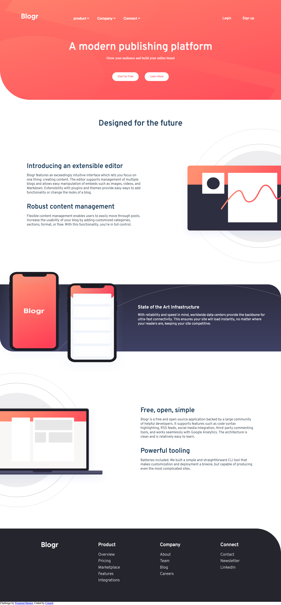

# Frontend Mentor - Blogr landing page solution

This is a solution to the [Blogr landing page challenge on Frontend Mentor](https://www.frontendmentor.io/challenges/blogr-landing-page-EX2RLAApP). Frontend Mentor challenges help you improve your coding skills by building realistic projects. 

## Table of contents

- [Overview](#overview)
  - [The challenge](#the-challenge)
  - [Screenshot](#screenshot)
  - [Links](#links)
- [My process](#my-process)
  - [Built with](#built-with)
  - [What I learned](#what-i-learned)
  - [Continued development](#continued-development)
  - [Useful resources](#useful-resources)
- [Author](#author)
- [Acknowledgments](#acknowledgments)

## Overview
Hey there, I'm cornell.
I'm working this design from a "mobile first, then desktop" layout.
I'll be using html/html5, css/css3 and Js, no frameworks.

### The challenge

Users would be able to:

- View the optimal layout for the site depending on their device's screen size
- See hover states for all interactive elements on the page

### Screenshot



### Links

- Live Site URL: [live Site](https://cornelldev.github.io/Blogr/)

## My process

- Design
- Developement

### Built with

- Semantic HTML5 markup
- CSS custom properties
- Flexbox
- Mobile-first workflow
- [Icons Components](https://fontawesome.com) - For Icons


### What I learned
- Background image; background positions(horizontal - vertical), background sizes(width - height).
- css Cacl() function

```css
Proud of this one!
.services-col-bg-img{
        background: url(images/illustration-editor-desktop.svg);
        background-repeat: no-repeat;
        background-position: calc(100% + 18vw) 0px;
        background-size: 900px 800px;
        margin-bottom: 0;
        height: 800px;
        width: 100%;
    }
```
```js
i.addEventListener('...', () => {
      i.classList.toggle('...');
  })
```

### Continued development

``css
- Background Images - still looks a little complex to me.
``js
- Calling same function on multiple elements.

## Author

- Website - [Cornell](http://cornell.netlify.app/)
- Twitter - [@corneldev](https://www.twitter.com/corneldev)